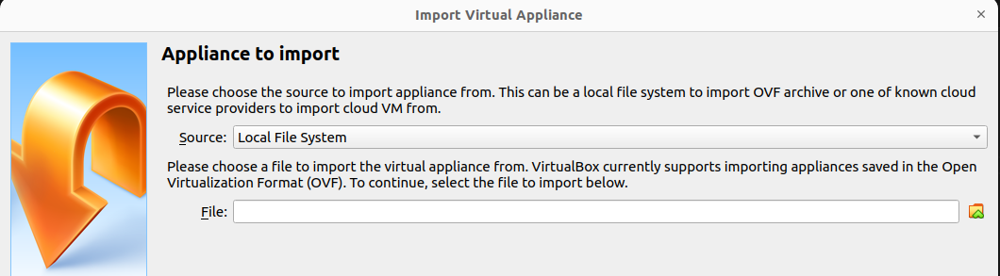

# Lab 1

## Virtualisation

1. [Télécharger et installer virtual box](https://download.virtualbox.org/virtualbox/6.0.24/VirtualBox-6.0.24-139119-Win.exe)
2. Ouvrer virtualbox et cliquer sur `file` puis `import appliance`
3. vous allez avoir la page suivante cliquez sur la petite coche jaune pour ajouter une machine

Sélectionner l'image `ubuntu-ros.ova` dans votre dossier téléchargement

5. Après l'importation terminée démarrez la machine virtuelle ubuntu-ros

6. Pour vous connecter entrer le mot de passe `admin` sur la session adminRos
